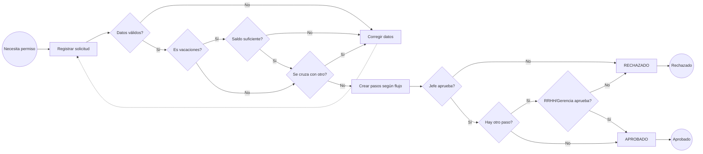

# BPM — Procesos de la Consultora Contable Andina S.A.C.

Semana 5 del temario: *¿Qué es BPM?, notación y uso, identificación de conceptos con ejemplos y taller de diagramas BPM del proyecto*.

**Diagramas (FigJam):** [Avance 2 - BPM RRHH Andina](https://www.figma.com/board/PyidatOHCjPMOXfprTeVi9) — 5 diagramas:

| Código | Proceso | Tipo |
|---|---|---|
| BPM 00 | Solicitud de permisos (proceso manual actual) | AS-IS |
| BPM 01 | Solicitud y aprobación de permisos | TO-BE |
| BPM 02 | Solicitud de horas extras | TO-BE |
| BPM 03 | Cálculo y cierre de planilla mensual | TO-BE |
| BPM 04 | Reclutamiento y selección | TO-BE |

---

## 1. ¿Qué es BPM?

**BPM (Business Process Management)** es la disciplina que gestiona una organización a partir de sus **procesos**: conjuntos de actividades encadenadas que transforman una entrada en un resultado de valor para un cliente (interno o externo).

No es un software, sino un ciclo de mejora continua:

| Fase | Qué se hace | En este proyecto |
|---|---|---|
| 1. Identificar | Listar los procesos y elegir cuáles mejorar | Entrevistas del Plan de Toma de Requerimientos v1.0 |
| 2. Modelar AS-IS | Dibujar cómo se trabaja hoy | BPM 00: permisos en papel/correo + Excel |
| 3. Analizar | Encontrar demoras, reprocesos y riesgos | Tabla de problemas (sección 4) |
| 4. Rediseñar TO-BE | Dibujar el proceso mejorado | BPM 01 a 04 |
| 5. Implementar | Automatizar con un sistema | API Spring Boot + React + triggers PostgreSQL |
| 6. Monitorear | Medir con indicadores | Reportes, auditoría y KPIs (sección 6) |

**BPMN (Business Process Model and Notation) 2.0** es el estándar gráfico para modelar esos procesos, entendible tanto por el negocio como por los desarrolladores.

---

## 2. Notación BPMN y su uso

| Categoría | Elemento | Símbolo | Uso |
|---|---|---|---|
| Eventos | Inicio | Círculo de borde fino | Qué dispara el proceso |
| | Intermedio | Círculo de doble borde | Algo que ocurre durante el proceso (mensaje, temporizador) |
| | Fin | Círculo de borde grueso | Resultado con el que termina |
| Actividades | Tarea | Rectángulo redondeado | Trabajo que hace un actor o el sistema |
| | Subproceso | Rectángulo con "+" | Tarea que agrupa otro proceso |
| Compuertas | Exclusiva (XOR) | Rombo con "X" | Una sola salida según una condición |
| | Paralela (AND) | Rombo con "+" | Todas las salidas a la vez |
| | Inclusiva (OR) | Rombo con "O" | Una o varias salidas |
| Flujos | Secuencia | Flecha continua | Orden de las actividades |
| | Mensaje | Flecha discontinua | Comunicación entre participantes |
| Contenedores | Pool | Rectángulo grande | Una organización o sistema |
| | Lane (carril) | Franja dentro del pool | Un rol o área responsable |
| Artefactos | Objeto de datos / almacén | Hoja / cilindro | Información que se lee o guarda |

**Guía visual (FigJam):** [BPMN - Guía de notación con ejemplos del proyecto](https://www.figma.com/board/ALb7EmLv7XOEh82juQEAxb). Un solo diagrama con carriles (Empleado, Sistema RRHH, Jefe inmediato, RRHH - planilla) donde cada símbolo lleva el nombre del elemento y un caso real: evento de inicio "Necesita permiso", tarea de usuario, tarea de servicio (trigger), almacén de datos, evento intermedio de notificación, flujo de mensaje, compuertas XOR con reproceso, compuerta paralela AND (asiento y boletas al cerrar la planilla), subproceso y eventos de fin.

> En FigJam se usa una notación BPMN simplificada: carriles como contenedores de color, círculos para eventos, rombos para compuertas exclusivas, rectángulos para tareas y cilindros para almacenes de datos. Las flechas punteadas representan un retorno (reproceso).

---

## 3. Identificación de conceptos en ejemplos del proyecto

| Concepto BPMN | Ejemplo real en el sistema RRHH |
|---|---|
| Evento de inicio | "Necesita permiso" (el colaborador tiene una cita médica) |
| Tarea de usuario | "Registrar solicitud" en la pantalla *Nuevo permiso* |
| Tarea de servicio (sistema) | "Crear pasos según flujo": lo ejecuta el trigger `fn_instanciar_pasos_aprobacion` |
| Compuerta exclusiva | "¿Es vacaciones?" → valida saldo (1.5 días por mes) solo en ese caso |
| Compuerta exclusiva con reproceso | "¿Se cruza con otro permiso?" → Sí: volver a "Corregir datos" |
| Carril (lane) | Empleado, Sistema RRHH, Jefe inmediato, RRHH o Gerencia |
| Almacén de datos | Base de datos PostgreSQL (`solicitud_permiso`, `solicitud_paso_aprobacion`) |
| Evento intermedio de mensaje | Notificación en la campana (STOMP/WebSocket) al aprobador |
| Evento de fin | "Permiso aprobado" / "Permiso rechazado" |
| Regla de negocio | Tope de 4 h diarias y 12 h semanales de horas extras (`parametro_sistema`) |

---

## 4. AS-IS → TO-BE: permisos

### Problemas del proceso actual (BPM 00)

| # | Problema | Efecto |
|---|---|---|
| 1 | Formato en papel o correo | Se pierden solicitudes; no hay estado visible |
| 2 | RRHH transcribe a Excel | Doble digitación y errores |
| 3 | Saldo de vacaciones verificado a mano | Se aprueban días que no corresponden |
| 4 | Sin control de cruces de fechas | Dos permisos el mismo día |
| 5 | El empleado "espera respuesta" sin plazo | Demora y reclamos |
| 6 | Sin trazabilidad | No se sabe quién aprobó ni cuándo |

### Mejoras del proceso nuevo (BPM 01)

| Problema | Mejora TO-BE | Implementación |
|---|---|---|
| 1, 5 | Registro en línea y estado en tiempo real | Pantallas *Permisos* y *Bandeja* + notificaciones |
| 2 | Un solo registro, sin transcripción | Tabla `solicitud_permiso` |
| 3 | Saldo calculado automáticamente | `ContratoService.validarVacaciones` |
| 4 | Validación de traslapo | `PermisoReglas.validarTraslapo` |
| 6 | Historial y auditoría | `historial_solicitud`, `auditoria` |
| — | Circuito configurable por trámite | `configuracion_aprobacion` (Jefe → RRHH → Gerencia) |

### BPM 01 en Mermaid (referencia para el repositorio)

---

## 5. Fichas de proceso

### BPM 01 — Solicitud y aprobación de permisos

| Campo | Detalle |
|---|---|
| Objetivo | Que todo permiso quede registrado, validado y aprobado por los responsables correctos |
| Disparador | El colaborador necesita ausentarse (salud, vacaciones, duelo, comisión, capacitación, particular) |
| Actores | Empleado, Sistema, Jefe inmediato, RRHH, Gerencia |
| Entradas | Tipo, fechas, horas opcionales, motivo (≥ 5 caracteres) |
| Salidas | Solicitud `APROBADO` o `RECHAZADO`, pasos e historial |
| Reglas | Hora fin > hora inicio; sin traslapo con permisos pendientes o aprobados; saldo de vacaciones; solo el aprobador del paso `EN_CURSO` decide |
| Circuitos | Salud / Duelo / Capacitación: Jefe → RRHH · Vacaciones: Jefe → RRHH → Gerencia · Comisión: Jefe → Gerencia · Particular: Jefe |

### BPM 02 — Solicitud de horas extras

| Campo | Detalle |
|---|---|
| Objetivo | Registrar y aprobar el tiempo extra para pagarlo en la planilla |
| Disparador | El colaborador trabajó fuera de su horario |
| Actores | Empleado, Sistema, Jefe inmediato, RRHH |
| Reglas | Máx. 8 h por registro; tope 4 h/día y 12 h/semana (`parametro_sistema`); flujo `CFG-HEXTRA` Jefe → RRHH |
| Salida | Horas aprobadas que la planilla paga al 125 % (`tasa_hora_extra`) |

### BPM 03 — Cálculo y cierre de planilla mensual

| Campo | Detalle |
|---|---|
| Objetivo | Calcular boletas correctas y generar el asiento contable del mes |
| Disparador | Inicio del periodo de pago |
| Actores | RRHH, Sistema, Contabilidad |
| Pasos del sistema | Recorrer empleados `ACTIVO` con contrato `VIGENTE` → básico + asignación familiar (10 % RMV) + horas extras → descuentos ONP 13 % o AFP (aporte 10 % + seguro 1.37 % + comisión) y ausencias → EsSalud 9 % (aporte del empleador) → totales |
| Estados | `BORRADOR` → `CALCULADA` → `CERRADA` (no se recalcula) |
| Reglas | Un solo periodo por año/mes; solo se cierra una planilla calculada; un asiento por planilla |
| Salidas | Boletas PDF, asiento de partida doble |

### BPM 04 — Reclutamiento y selección

| Campo | Detalle |
|---|---|
| Objetivo | Cubrir una vacante con el candidato adecuado |
| Actores | Jefe de área, RRHH, Postulante |
| Estados de convocatoria | `ABIERTA` → `CERRADA` / `CANCELADA` |
| Estados de postulación | `POSTULADO` → `ENTREVISTA` → `SELECCIONADO` → `CONTRATADO`, o `DESCARTADO` |
| Salida | Nuevo empleado con contrato registrado |

---

## 6. Indicadores para monitorear los procesos

| Indicador | Fórmula | Fuente |
|---|---|---|
| Tiempo medio de aprobación | promedio(`fecha_decision` del último paso − `fecha_creacion` de la solicitud) | `v_trazabilidad_solicitudes` |
| Tasa de rechazo | rechazadas / total del periodo | `v_reporte_permisos` |
| Horas extras por colaborador | suma(`cantidad_horas`) aprobadas por mes | `v_reporte_horas_extras` |
| Puntualidad | ingresos después de la hora de horario / total de ingresos | `v_reporte_asistencia` |
| Costo laboral del mes | `total_bruto` + `total_aportes` | `planilla` |
| Días para cubrir una vacante | fecha de contratación − `convocatoria.fecha_inicio` | `convocatoria`, `postulacion` |
