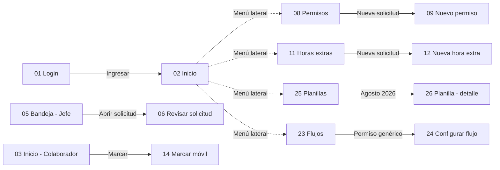

# Diseño UX/UI y reportes

Semanas 7 y 8 del temario: *UX/UI, identificación de reportes, mapeo de reportes clave y taller de prototipado*.

**Prototipo navegable (Figma):** [RRHH Andina - Prototipo UX/UI (frontend real)](https://www.figma.com/design/e8HCwGg9xywFm98J5vyEGm)
Para recorrerlo: abrir el archivo → botón **Present** (▶). El flujo "Flujo principal RRHH" empieza en el Login.

Las 31 pantallas son capturas del frontend en ejecución (React + Tailwind) con los datos de la base de desarrollo, así que el diseño, los textos y los componentes son exactamente los de la aplicación. Están agrupadas en secciones por módulo: *Acceso y roles*, *Operacion*, *Administracion* y *Gestion y control*.

Antecedente: el laboratorio UX del avance anterior (mapa de empatía, sketches, wireframes y mockups) está en [`docs/laboratorio-ux/`](../../docs/laboratorio-ux/README.md). Este avance lleva esos wireframes a un prototipo de alta fidelidad con los datos y reglas reales del sistema.

---

## 1. Usuarios del sistema

| Rol | Persona semilla | Objetivo principal | Frecuencia de uso | Dispositivo |
|---|---|---|---|---|
| EMPLEADO | Juan Espinoza | Marcar asistencia, pedir permisos y horas extras, ver su estado | Diario | Celular y PC |
| JEFE | Jesús Pantoja | Aprobar rápido las solicitudes de su equipo | Diario | PC |
| RRHH | Carla Reyes | Validar trámites, gestionar personal, calcular planilla, exportar reportes | Diario, intensivo a fin de mes | PC |
| GERENCIA | — | Aprobar vacaciones y comisiones, ver reportes | Semanal | PC y celular |
| ADMIN | Jesús Mechan | Configurar usuarios, roles, menús, flujos y parámetros | Ocasional | PC |

### Menú por rol (tabla `menu_rol`)

| Opción | EMPLEADO | JEFE | GERENCIA | RRHH | ADMIN |
|---|:-:|:-:|:-:|:-:|:-:|
| Inicio, Bandeja, Permisos, Horas extras, Marcar, Asistencia, Mi perfil | ✓ | ✓ | ✓ | ✓ | ✓ |
| Desempeño | | ✓ | ✓ | ✓ | ✓ |
| Personal | | | ✓ | ✓ | ✓ |
| Reportes | | | ✓ | ✓ | ✓ |
| Contratos, Maestros, Usuarios, Flujos | | | | ✓ | ✓ |
| Planillas, Contabilidad, Reclutamiento, Auditoría | | | | ✓ | ✓ |
| Roles, Menú | | | | | ✓ |

---

## 2. Principios UX/UI aplicados

| Principio | Aplicación en el prototipo |
|---|---|
| Visibilidad del estado del sistema | Badges de estado con color y texto (PENDIENTE, EN CURSO, APROBADO, RECHAZADO); paso actual "2 de 3" |
| Prevenir errores antes que mostrarlos | El formulario de permiso muestra el saldo de vacaciones y las validaciones antes de enviar |
| Reconocer antes que recordar | El circuito que se aplicará aparece al lado del formulario; no hay que recordar quién aprueba |
| Consistencia | Un solo set de componentes (botón, badge, campo, ítem de menú) y tokens tomados de `styles.css` |
| Jerarquía visual | Un botón primario por pantalla (oscuro); acciones destructivas en rojo; aprobar en verde |
| Menos es más | El menú muestra solo lo que el rol puede usar |
| Accesibilidad | Contraste alto (texto `#0F172A` sobre `#F8FAFC`), el estado nunca depende solo del color: siempre lleva texto |
| Mobile first para el colaborador | Marcación diseñada para celular (390 × 844) con botones de ancho completo |

### Sistema de diseño (tokens de `frontend/src/styles.css`)

| Token | Valor | Uso |
|---|---|---|
| `primary` / `primary-hover` | `#0F172A` / `#1E293B` | Botón primario, ítem de menú activo, títulos |
| `surface` | `#F8FAFC` | Fondo de la aplicación |
| `line` | `#E2E8F0` | Bordes de tarjetas, tablas y campos |
| `muted` | `#64748B` | Texto secundario |
| `danger` / `danger-soft` | `#DC2626` / `#FEF2F2` | Rechazado, errores, acciones destructivas |
| `ok` / `ok-soft` | `#047857` / `#ECFDF5` | Aprobado, activo |
| `warn` / `warn-soft` | `#B45309` / `#FFFBEB` | Pendiente, alertas |
| `info` / `info-soft` | `#0369A1` / `#F0F9FF` | En curso, información |

Tipografía **Inter**. Componentes reutilizados en todas las pantallas: botón (primario, secundario, peligro), badge de estado, campo de formulario, tarjeta, tabla, ítem de menú (normal/activo) y la barra lateral (`AppShell`).

---

## 3. Pantallas prototipadas

| # | Pantalla | Ruta del frontend | Rol capturado | Nodo Figma |
|---|---|---|---|---|
| | **Acceso y roles** | | | |
| 01 | Login | `/login` | Todos | [abrir](https://www.figma.com/design/e8HCwGg9xywFm98J5vyEGm?node-id=28-2) |
| 02 | Inicio - Administrador | `/` | ADMIN | [abrir](https://www.figma.com/design/e8HCwGg9xywFm98J5vyEGm?node-id=2-2) |
| 03 | Inicio - Colaborador | `/` | EMPLEADO | [abrir](https://www.figma.com/design/e8HCwGg9xywFm98J5vyEGm?node-id=31-2) |
| 04 | Acceso restringido | `/usuarios` sin permiso | EMPLEADO | [abrir](https://www.figma.com/design/e8HCwGg9xywFm98J5vyEGm?node-id=32-2) |
| | **Operación** | | | |
| 05 | Bandeja - Jefe | `/bandeja` | JEFE (1 pendiente) | [abrir](https://www.figma.com/design/e8HCwGg9xywFm98J5vyEGm?node-id=29-2) |
| 06 | Revisar solicitud - Jefe | `/bandeja/:idPaso` | JEFE | [abrir](https://www.figma.com/design/e8HCwGg9xywFm98J5vyEGm?node-id=30-2) |
| 07 | Bandeja - Administrador | `/bandeja` | ADMIN | [abrir](https://www.figma.com/design/e8HCwGg9xywFm98J5vyEGm?node-id=4-2) |
| 08 | Permisos | `/permisos` | ADMIN | [abrir](https://www.figma.com/design/e8HCwGg9xywFm98J5vyEGm?node-id=5-2) |
| 09 | Nuevo permiso | `/permisos/nuevo` | ADMIN | [abrir](https://www.figma.com/design/e8HCwGg9xywFm98J5vyEGm?node-id=6-2) |
| 10 | Detalle de permiso | `/permisos/:id` | ADMIN | [abrir](https://www.figma.com/design/e8HCwGg9xywFm98J5vyEGm?node-id=7-2) |
| 11 | Horas extras | `/horas-extras` | ADMIN | [abrir](https://www.figma.com/design/e8HCwGg9xywFm98J5vyEGm?node-id=8-2) |
| 12 | Nueva hora extra | `/horas-extras/nuevo` | ADMIN | [abrir](https://www.figma.com/design/e8HCwGg9xywFm98J5vyEGm?node-id=9-2) |
| 13 | Marcar | `/marcar` | ADMIN | [abrir](https://www.figma.com/design/e8HCwGg9xywFm98J5vyEGm?node-id=12-2) |
| 14 | Marcar (móvil, 390 px) | `/marcar` | EMPLEADO | [abrir](https://www.figma.com/design/e8HCwGg9xywFm98J5vyEGm?node-id=33-2) |
| 15 | Asistencia | `/asistencia` | ADMIN | [abrir](https://www.figma.com/design/e8HCwGg9xywFm98J5vyEGm?node-id=10-2) |
| 16 | Mi perfil | `/perfil` | ADMIN | [abrir](https://www.figma.com/design/e8HCwGg9xywFm98J5vyEGm?node-id=11-2) |
| | **Administración** | | | |
| 17 | Personal | `/empleados` | ADMIN | [abrir](https://www.figma.com/design/e8HCwGg9xywFm98J5vyEGm?node-id=13-2) |
| 18 | Contratos | `/contratos` | ADMIN | [abrir](https://www.figma.com/design/e8HCwGg9xywFm98J5vyEGm?node-id=14-2) |
| 19 | Maestros | `/maestros` | ADMIN | [abrir](https://www.figma.com/design/e8HCwGg9xywFm98J5vyEGm?node-id=15-2) |
| 20 | Usuarios | `/usuarios` | ADMIN | [abrir](https://www.figma.com/design/e8HCwGg9xywFm98J5vyEGm?node-id=16-2) |
| 21 | Roles | `/roles` | ADMIN | [abrir](https://www.figma.com/design/e8HCwGg9xywFm98J5vyEGm?node-id=17-2) |
| 22 | Menú | `/menu` | ADMIN | [abrir](https://www.figma.com/design/e8HCwGg9xywFm98J5vyEGm?node-id=18-2) |
| 23 | Flujos | `/flujos` | ADMIN | [abrir](https://www.figma.com/design/e8HCwGg9xywFm98J5vyEGm?node-id=19-2) |
| 24 | Configurar flujo | `/flujos/:id` | ADMIN | [abrir](https://www.figma.com/design/e8HCwGg9xywFm98J5vyEGm?node-id=20-2) |
| | **Gestión y control** | | | |
| 25 | Planillas | `/planillas` | ADMIN | [abrir](https://www.figma.com/design/e8HCwGg9xywFm98J5vyEGm?node-id=21-2) |
| 26 | Planilla - detalle (Agosto 2026) | `/planillas/:id` | ADMIN | [abrir](https://www.figma.com/design/e8HCwGg9xywFm98J5vyEGm?node-id=22-2) |
| 27 | Contabilidad | `/contabilidad` | ADMIN | [abrir](https://www.figma.com/design/e8HCwGg9xywFm98J5vyEGm?node-id=23-2) |
| 28 | Desempeño | `/desempeno` | ADMIN | [abrir](https://www.figma.com/design/e8HCwGg9xywFm98J5vyEGm?node-id=24-2) |
| 29 | Reclutamiento | `/reclutamiento` | ADMIN | [abrir](https://www.figma.com/design/e8HCwGg9xywFm98J5vyEGm?node-id=25-2) |
| 30 | Reportes (reporte Trabajadores) | `/reportes` | ADMIN | [abrir](https://www.figma.com/design/e8HCwGg9xywFm98J5vyEGm?node-id=26-2) |
| 31 | Auditoría | `/auditoria` | ADMIN | [abrir](https://www.figma.com/design/e8HCwGg9xywFm98J5vyEGm?node-id=27-2) |

### Flujo navegable

Cada ítem del menú lateral, en todas las pantallas, lleva a su pantalla correspondiente (más de 500 enlaces). En las pantallas del colaborador, "Inicio" vuelve a la 03; en las del jefe, "Bandeja" abre la 05.

---

## 4. Identificación de reportes

Se identificaron los reportes a partir de las preguntas que cada rol necesita responder:

| Rol | Pregunta de negocio | Reporte |
|---|---|---|
| RRHH | ¿Quién estuvo ausente y por qué en el mes? | Permisos |
| RRHH / Jefe | ¿Cuántas horas extras se aprobaron y a quién se pagan? | Horas extras |
| RRHH / Jefe | ¿Quién llega tarde o no marcó? | Asistencia |
| Gerencia / RRHH | ¿Cuánto personal activo hay por área y cargo? | Trabajadores |
| ADMIN | ¿Qué cuentas existen, con qué rol y cuándo se usaron? | Usuarios |
| RRHH / Contabilidad | ¿Cuánto se paga a cada colaborador? | Boletas de planilla (PDF) |
| Contabilidad | ¿Cómo se registra el gasto de planilla? | Asiento contable |
| Auditoría | ¿Quién aprobó qué y cuándo? | Trazabilidad / bitácora |

## 5. Mapeo de reportes clave

**Mapa visual (FigJam):** [Mapa de reportes clave](https://www.figma.com/board/ALb7EmLv7XOEh82juQEAxb): rol con acceso, reporte, tabla o vista de origen y formato de salida; las exportaciones Excel/PDF quedan en `reporte_generado`.

La API arma los reportes con `ReporteService` (JPA sobre las tablas). Las vistas `v_reporte_*` de la base ofrecen los mismos datos para consultas directas o herramientas de BI con el rol de solo lectura `rrhh_reportes`.

| Reporte | Tablas (API) / vista (BI) | Filtros implementados | Filtros propuestos (prototipo) | Columnas principales | Formatos | Endpoint | Usuarios |
|---|---|---|---|---|---|---|---|
| Permisos | `solicitud_permiso` / `v_reporte_permisos` | — (lista completa) | desde, hasta, área, estado | código, colaborador, tipo, fechas, días, estado | JSON, Excel, PDF | `GET /api/reportes/permisos`, `/api/reportes/PERMISOS/excel` y `/pdf` | RRHH, Gerencia, Admin |
| Horas extras | `solicitud_hora_extra` / `v_reporte_horas_extras` | — | desde, hasta, área, estado | colaborador, fecha, horario, horas, estado | JSON, Excel, PDF | `GET /api/reportes/horas-extras` | RRHH, Gerencia, Admin |
| Asistencia | `marcacion` / `v_reporte_asistencia` | colaborador, desde, hasta | área | fecha, tipo, hora, origen | JSON, Excel, PDF | `GET /api/reportes/asistencia` | RRHH, Gerencia, Admin |
| Trabajadores | `empleado` / `v_empleado` | — | área, estado | código, documento, nombres, área, cargo, jefe, estado | JSON, Excel, PDF | `GET /api/reportes/trabajadores` | RRHH, Gerencia, Admin |
| Usuarios | `usuario` / `v_reporte_usuarios` | — | rol, activo | usuario, colaborador, rol, activo, último acceso | JSON, Excel, PDF | `GET /api/reportes/usuarios` | Admin |
| Boletas | `planilla`, `planilla_detalle` | periodo (id de planilla), colaborador | — | básico, asignación familiar, horas extras, ONP/AFP, EsSalud, neto | PDF | `GET /api/planillas/{id}/boletas/pdf` y `/boletas/{idDetalle}/pdf` | RRHH |
| Asiento contable | `asiento_contable`, `asiento_linea` | asiento | periodo | cuenta, nombre, debe, haber | Pantalla | `GET /api/asientos`, `/api/asientos/{id}` | RRHH, Contabilidad |
| Auditoría y trazabilidad | `auditoria`, `historial_solicitud` / `v_trazabilidad_solicitudes` | según pantalla | entidad, usuario, fechas | acción, usuario, fecha, estado anterior/nuevo | Pantalla | `GET /api/auditoria`, `GET /api/trazabilidad` | Admin, RRHH |

Cada exportación Excel/PDF queda registrada en `reporte_generado` (usuario, tipo, formato y filtros en `JSONB`) para auditoría. La pantalla 30 del prototipo muestra la vista real de reportes (selector de tipo, vista previa y botones Excel/PDF). Los filtros de la columna "propuestos" quedan como mejora para la fase de construcción.

### Diseño del reporte impreso (PDF)

- Cabecera: razón social, RUC, título del reporte, filtros aplicados y fecha/hora de generación.
- Cuerpo: tabla con cabecera repetida en cada página y montos alineados a la derecha.
- Pie: usuario que generó el reporte y número de página "n de m".
