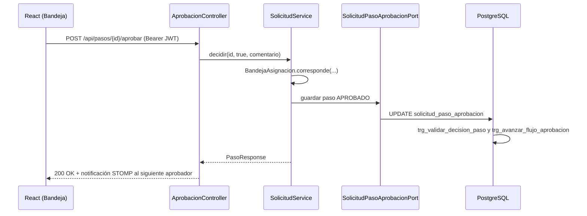

# Guía para desarrolladores

Semana 7–8 del temario: *documentación para desarrolladores (Javadoc, Markdown)*.

| Recurso | Ubicación |
|---|---|
| Javadoc HTML del backend | [`javadoc/index.html`](javadoc/index.html) (abrir en el navegador) |
| Arquitectura hexagonal | [`docs/ARQUITECTURA_DE_PROYECTO.md`](../../docs/ARQUITECTURA_DE_PROYECTO.md) |
| Referencia de la API | [`docs/API.md`](../../docs/API.md) y Swagger en `http://localhost:8080/swagger-ui.html` |
| Base de datos | [DISENO_BD.md](../02-base-de-datos/DISENO_BD.md), [DICCIONARIO_DATOS.md](../02-base-de-datos/DICCIONARIO_DATOS.md) |
| Cuentas de prueba | [`docs/PRUEBAS.md`](../../docs/PRUEBAS.md) |

---

## 1. Puesta en marcha

Requisitos: PostgreSQL 16, JDK 21, Maven 3.9+, Node.js 20+.

```bash
# 1. Base de datos (pgAdmin): 00_create_database.sql sobre "postgres", luego 01_install.sql sobre "rrhh_andina"

# 2. Backend
cd backend
copy .env.example .env        # editar credenciales
mvn spring-boot:run           # http://localhost:8080

# 3. Frontend
cd frontend
npm install
npm run dev                   # http://localhost:5173 (proxy /api → 8080)
```

### Variables de entorno (`backend/.env`)

| Variable | Obligatoria | Uso |
|---|---|---|
| `DB_URL`, `DB_USERNAME`, `DB_PASSWORD` | Sí | Conexión JDBC. Usar `127.0.0.1` si Docker ocupa el 5432 por IPv6 |
| `JWT_SECRET` | Sí | Firma de tokens, mínimo 32 caracteres. Cambiarlo invalida todas las sesiones |
| `CORS_ORIGINS` | No | Orígenes permitidos del frontend |
| `RATE_LIMIT_ENABLED`, `RATE_LIMIT_API`, `RATE_LIMIT_AUTH` | No | Límite de peticiones por minuto (general y login) |
| `IDEMPOTENCY_ENABLED`, `IDEMPOTENCY_TTL_HOURS` | No | Evita duplicar operaciones de escritura reenviadas |

---

## 2. Arquitectura en una página

```
backend/src/main/java/pe/andina/rrhh/
├── domain/                 Núcleo: entidades, enums, reglas (PermisoReglas, HoraExtraReglas)
├── application/
│   ├── port/in/            Casos de uso (interfaces: SolicitudUseCase, PlanillaUseCase…)
│   ├── port/out/           Lo que la aplicación necesita del exterior (repositorios, PDF, push)
│   ├── service/            Implementación de los casos de uso
│   └── dto/                Records de entrada y salida
├── adapter/
│   ├── in/web/             Controladores REST, manejo global de errores, rate limit, idempotencia
│   ├── in/security/        JWT y Spring Security
│   ├── in/ws/              WebSocket/STOMP (notificaciones)
│   └── out/                JPA (persistence), PDF (OpenPDF), push STOMP
└── config/                 Seguridad, CORS, OpenAPI, WebSocket
```

Regla de dependencias: `adapter → application → domain`. El dominio no conoce Spring MVC ni JPA de repositorios; la aplicación habla con el exterior solo por puertos.

### Recorrido de una petición: aprobar un paso



---

## 3. Cómo agregar un caso de uso (receta)

1. **Base de datos**: agregar la tabla o columna en `database/01_install.sql` (Hibernate usa `ddl-auto: none`). Regenerar el diccionario: `node avance2-integrador1/02-base-de-datos/generar-diccionario.mjs`.
2. **Dominio**: entidad en `domain/model` y, si hay reglas, un componente en `domain/service`.
3. **Puerto de salida**: interfaz en `application/port/out` y su adaptador JPA en `adapter/out/persistence`.
4. **Puerto de entrada**: interfaz en `application/port/in` **con Javadoc** (ver sección 4).
5. **Servicio**: implementación en `application/service`, anotada `@Transactional`; registrar en `AuditoriaService` las operaciones de escritura.
6. **Controlador**: en `adapter/in/web`, con `@Operation` de OpenAPI para que aparezca en Swagger.
7. **Frontend**: página en `frontend/src/pages`, llamadas vía `src/api/client.js`; si es una opción nueva de menú, insertarla en `menu_item` y `menu_rol`.
8. **Documentación**: actualizar `docs/API.md` y, si cambia un proceso, el BPM correspondiente.

---

## 4. Estándar de Javadoc

**Qué se documenta**: toda interfaz de `application/port/in`, los componentes de `domain/service` y cualquier método público con reglas de negocio no evidentes. No se documentan getters, setters ni controladores triviales.

**Qué debe decir**: el contrato (qué hace, qué devuelve, qué estados cambia) y las reglas o errores; no cómo está implementado.

Plantilla:

```java
/**
 * Cierra la planilla y genera su asiento contable.
 *
 * @param id identificador de la planilla
 * @return la planilla en estado {@code CERRADA}
 * @throws pe.andina.rrhh.domain.exception.DomainException si no está calculada o ya tiene asiento
 */
PlanillaResponse cerrar(Integer id);
```

Convenciones:

- Primera oración corta en tercera persona ("Cierra…", "Registra…"); es la que aparece en el resumen.
- Estados, columnas y valores literales con `{@code ...}`.
- `@throws DomainException` indicando el caso (400 datos inválidos, 403 sin permiso, 404 no existe, 409 conflicto).
- En español, igual que el resto del código.

Clases ya documentadas en este avance: `SolicitudUseCase`, `PlanillaUseCase`, `PermisoReglas`, `HoraExtraReglas` (además de los `package-info.java` de cada capa).

### Generar el Javadoc

```bash
cd backend
mvn org.apache.maven.plugins:maven-javadoc-plugin:3.11.2:javadoc -Ddoclint=none -Dshow=protected -Dencoding=UTF-8 -Ddocencoding=UTF-8 -Dcharset=UTF-8
# Salida: backend/target/reports/apidocs/index.html
```

Para publicar la versión del avance se copia `target/reports/apidocs` a `avance2-integrador1/04-documentacion/javadoc`.

---

## 5. Convenciones de Markdown

- Un `README.md` por carpeta de entregable y un único `#` (título) por archivo.
- Tablas para datos enumerables; listas para pasos; bloques de código con lenguaje (`bash`, `sql`, `java`).
- Diagramas en Mermaid dentro del Markdown (GitHub los dibuja) y la versión editable en Figma/FigJam.
- Enlaces relativos entre documentos (`../../docs/API.md`), nunca rutas absolutas del disco.
- Nombres de archivo en MAYÚSCULAS para documentos (`DISENO_BD.md`) y minúsculas para scripts.

---

## 6. Convenciones de código

| Tema | Regla |
|---|---|
| Nombres | Clases y métodos en español del dominio (`calcular`, `cerrar`, `PermisoReglas`) |
| Errores | Lanzar `DomainException.badRequest / forbidden / notFound / conflict`; `GlobalExceptionHandler` los convierte en `ApiError` JSON |
| Transacciones | `@Transactional` en servicios; `readOnly = true` en consultas |
| Seguridad | Toda regla de "quién puede" pasa por `EmpleadoScope` o `BandejaAsignacion`, nunca solo por el frontend |
| Dinero | `BigDecimal` con escala 2 y `RoundingMode.HALF_UP` |
| Fechas | `LocalDate` para días, `OffsetDateTime` para instantes; zona `America/Lima` |
| SQL | Solo en `database/*.sql`; nombres `snake_case`; restricciones con prefijo `uq_`, `ck_`, `ix_` |
| Commits | Mensaje en imperativo y en español: "Agrega validación de tope semanal de horas extras" |
