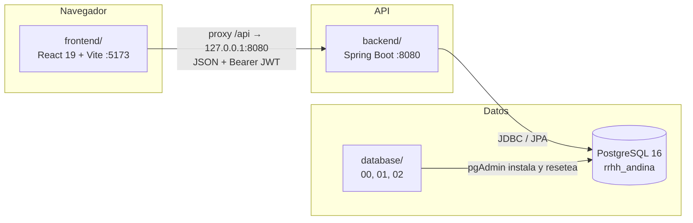
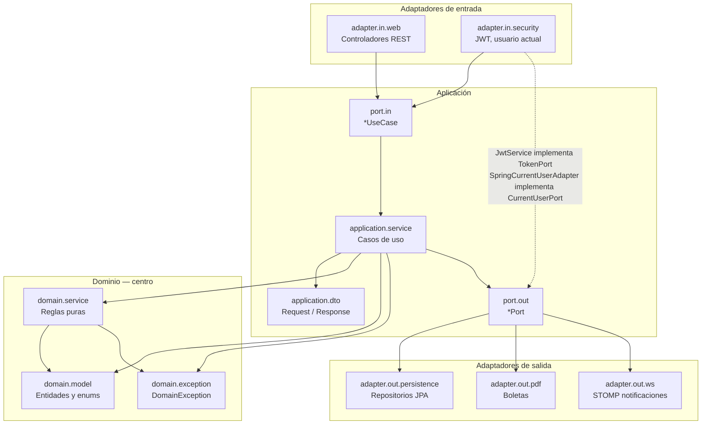
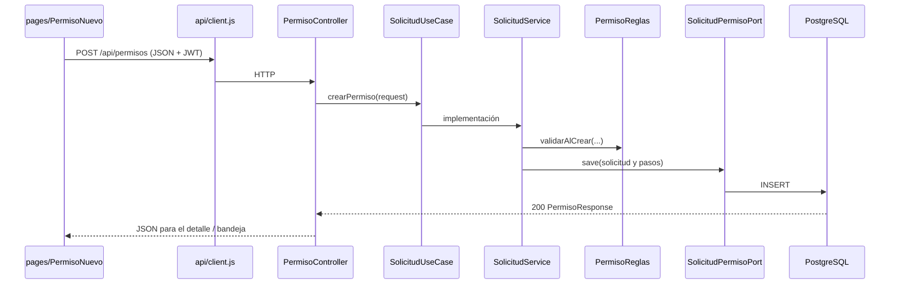

# Arquitectura del proyecto

Sistema de Gestión de RR. HH. — Consultora Contable Andina S.A.C.

Este documento explica **qué es la arquitectura hexagonal**, cómo está organizada en este repositorio y **cómo se comunica cada carpeta** con las demás.

Endpoints: [API.md](API.md). Modelo de datos: [BASE_DE_DATOS.md](BASE_DE_DATOS.md) y [MER.md](MER.md).

---

## 1. Concepto: arquitectura hexagonal

La **arquitectura hexagonal** (también llamada *Ports and Adapters*) la planteó Alistair Cockburn. La idea es simple: el **negocio vive en el centro** y todo lo demás (pantallas, HTTP, base de datos, PDF, JWT) queda **afuera**, conectado por contratos.

El centro se dibuja como un hexágono para dejar claro que **no hay una sola “capa de arriba”**. Pueden llegar varios orígenes (un navegador, Swagger, un lote) y pueden salir varios destinos (PostgreSQL, un archivo PDF, un token). El dominio no debería saber si lo llamó React o un test.

### Piezas

| Pieza | Qué es | En este proyecto |
|---|---|---|
| **Dominio** | Entidades, enumeraciones y reglas de negocio | `domain/` |
| **Aplicación** | Casos de uso: orquesta el dominio | `application/service/` |
| **Puerto de entrada** (*driving*) | Contrato que el mundo exterior usa para pedir un caso de uso | `application/port/in/` (`*UseCase`) |
| **Puerto de salida** (*driven*) | Contrato que el caso de uso necesita (guardar, leer sesión, emitir token, generar PDF) | `application/port/out/` (`*Port`) |
| **Adaptador de entrada** | Traduce HTTP o seguridad al puerto de entrada | `adapter/in/web`, `adapter/in/security` |
| **Adaptador de salida** | Implementa un puerto de salida con una tecnología concreta | `adapter/out/persistence`, `adapter/out/pdf` |

### Regla de dependencia

Las flechas **siempre apuntan hacia adentro**:

1. El **dominio** no importa Spring MVC, JPA como API de servicio, ni React.
2. La **aplicación** depende del dominio y de **interfaces** (puertos), no de controladores ni de PostgreSQL.
3. Los **adaptadores** conocen frameworks (Spring, JPA, OpenPDF, JJWT) y **cumplen** los puertos.

Así se puede cambiar el frontend, el motor de PDF o incluso el proveedor de tokens **sin reescribir** las reglas de permisos, planilla o bandeja.

---

## 2. Vista del sistema

El producto no es solo el hexágono Java. Hay tres procesos que se hablan por HTTP y SQL:



| Carpeta raíz | Responsabilidad |
|---|---|
| `frontend/` | Interfaz. No calcula planilla ni aprueba pasos: llama a `/api/...`. |
| `backend/` | Hexágono: casos de uso, seguridad JWT y persistencia. |
| `database/` | Scripts de instalación (`00`, `01`) y reset de demo (`02`). |
| `docs/` | Documentación del curso (API, base, pruebas, MER, esta arquitectura). |

Al arrancar, Vite (puerto **5173**) reenvía `/api` a `http://127.0.0.1:8080`. El navegador nunca habla directo con PostgreSQL.

---

## 3. El hexágono del backend

Paquete base: `pe.andina.rrhh`.



`config/` (Security, CORS, OpenAPI, carga de `.env`, parche `schema.sql`) **no es una capa del hexágono**: es el cableado de Spring para que los adaptadores funcionen.

---

## 4. Cómo se comunica cada carpeta

### 4.1 Frontend (`frontend/src`)

| Carpeta | Habla con | Para qué |
|---|---|---|
| `pages/` | `api/client.js` y `auth/` | Pantallas (permisos, bandeja, planillas, etc.). |
| `layout/` | `auth/` y rutas de `App.jsx` | Menú según el perfil de la sesión. |
| `components/` | `pages/` | Controles reutilizables (tablas, filtros, historial de solicitud). |
| `auth/` | `api/client.js` y `/api/auth`, `/api/sesion` | Login, rol, menú y `canAccess`. |
| `api/` | Backend vía `fetch('/api/...')` | JWT en `localStorage`, refresh y errores HTTP. |
| `lib/` | `pages/` | Fechas, búsquedas y helpers de listados. |

Flujo típico en pantalla:

`Login.jsx` → `http.post('/api/auth/login')` → guarda tokens → `App.jsx` arma rutas privadas → cada página pide JSON al controlador que le corresponde.

### 4.2 Backend — entrada

| Carpeta | Habla con | Para qué |
|---|---|---|
| `adapter/in/web` | Solo `application.port.in` y DTOs | Recibe HTTP, valida el body y delega. **No** abre repositorios. |
| `adapter/in/security` | Spring Security y, hacia afuera, `TokenPort` / `CurrentUserPort` | Filter JWT, `JwtService`, `UsuarioDetailsService`. |
| `adapter/in/ws` | Handshake y CONNECT STOMP | Autentica el socket con el access token. |
| `adapter/in/web/GlobalExceptionHandler` | `DomainException` | Traduce códigos de dominio a HTTP (404, 400, 403, 409…). |

Ejemplo: `PermisoController` inyecta `SolicitudUseCase`, no `SolicitudService`. Spring entrega la implementación.

### 4.3 Backend — aplicación

| Carpeta | Habla con | Para qué |
|---|---|---|
| `application/port/in` | Implementada por `application/service` | Contratos públicos: `SolicitudUseCase`, `AuthUseCase`, `PlanillaUseCase`, etc. |
| `application/service` | Dominio + `port.out` + otros `*UseCase` | Orquesta: crear permiso, calcular planilla, armar bandeja. |
| `application/dto` | Controladores y servicios | Records de entrada/salida (`PermisoRequest`, `BandejaItem`…). |
| `application/port/out` | Implementada por persistencia, PDF y seguridad | `EmpleadoPort`, `SolicitudPermisoPort`, `BoletaPdfPort`, `TokenPort`, `CurrentUserPort`. |

El caso de uso **pide un puerto** (`permisoRepository.save(...)`). No sabe si detrás hay JPA u otra cosa.

### 4.4 Backend — dominio

| Carpeta | Habla con | Para qué |
|---|---|---|
| `domain/model` | Tablas de `rrhh_andina` (mapeo JPA) | `Empleado`, `SolicitudPermiso`, `Planilla`, `Rol`… |
| `domain/model/enums` | El modelo | `EstadoSolicitud`, `TipoAprobador`, `TipoMarcacion`… |
| `domain/service` | Modelo y, si hace falta, puertos | Reglas: `PermisoReglas`, `HoraExtraReglas`, `BandejaAsignacion`. |
| `domain/exception` | Servicios de aplicación y `GlobalExceptionHandler` | Errores de negocio **sin** tipos de Spring. |

`BandejaAsignacion` decide si un paso es del jefe inmediato, de un rol (`RRHH`, `GERENCIA`) o de un usuario concreto. Eso es dominio: no depende de un controlador.

### 4.5 Backend — salida e infraestructura

| Carpeta | Habla con | Para qué |
|---|---|---|
| `adapter/out/persistence` | PostgreSQL vía Spring Data | Cada `*Repository` **extiende** `JpaRepository` **y** el `*Port`. |
| `adapter/out/pdf` | OpenPDF | `BoletaPdfService` implementa `BoletaPdfPort`. |
| `adapter/out/ws` | Broker STOMP en memoria | Empuja notificaciones a `/user/queue/notificaciones`. |
| `config/` | Adaptadores | CORS, cadena JWT, Swagger, `MenuSchemaInitializer`. |
| `resources/db/schema.sql` | Base ya instalada | Parche idempotente al arrancar (roles, menú, cuentas de demo). |

### 4.6 Base de datos (`database/`)

| Archivo | Habla con | Para qué |
|---|---|---|
| `00_create_database.sql` | Instancia PostgreSQL | Crea `rrhh_andina`. |
| `01_install.sql` | Esquema `public` | Tablas, menú, roles, 4 cuentas y flujos. |
| `02_reset.sql` | Misma base | Limpia trámites y vuelve a sembrar la demo. |

JPA no crea el modelo: el origen de verdad del esquema es `01_install.sql`.

---

## 5. Recorrido de una solicitud (ejemplo)

Juan (`EMPLEADO`) registra un permiso particular. El primer paso debe quedar en su jefe inmediato (Pantoja), según el organigrama.



Más adelante, Pantoja abre **Bandeja**. `AprobacionController` llama `SolicitudUseCase.bandeja()`. El servicio usa `BandejaAsignacion` (dominio) y `CurrentUserPort` (quién está logueado, sin acoplar Spring Security al caso de uso).

Si el trámite es de salud, el paso 2 lo atiende el rol `RRHH` (`carla.reyes`). Si es comisión, el paso 2 es `GERENCIA` (en la demo lo cubre `jesus.mechan` como `ADMIN`).

---

## 6. Mapa de paquetes Java

```
backend/src/main/java/pe/andina/rrhh/
├── RrhhApplication.java          # Arranque
├── config/                       # Cableado Spring (no es dominio)
├── domain/
│   ├── model/                    # Entidades
│   ├── model/enums/
│   ├── service/                  # Reglas
│   └── exception/                # DomainException
├── application/
│   ├── dto/
│   ├── port/in/                  # Use cases (entrada)
│   ├── port/out/                 # Ports (salida)
│   └── service/                  # Implementación de use cases
└── adapter/
    ├── in/web/                   # REST
    ├── in/security/              # JWT y usuario actual
    └── out/
        ├── persistence/          # JPA
        └── pdf/                  # Boletas
```

En el frontend:

```
frontend/src/
├── main.jsx / App.jsx            # Rutas
├── api/client.js                 # Única puerta HTTP
├── auth/AuthContext.jsx          # Sesión y menú
├── layout/                       # Shell y menú
├── pages/                        # Una pantalla por caso de uso de UI
├── components/                   # UI compartida
└── lib/                          # Utilidades
```

---

## 7. Qué gana el proyecto con este corte

- **Un caso de uso, varios orígenes.** El mismo `SolicitudUseCase` sirve a la pantalla de Permisos, a la Bandeja y a Swagger.
- **Infraestructura reemplazable.** El PDF de boleta o el algoritmo de JWT se cambian detrás de `BoletaPdfPort` y `TokenPort`.
- **Reglas localizables.** Traslape de permisos, tope de horas extras y “¿este paso es mío?” viven en `domain/service`, no en el controlador.
- **Errores de negocio estables.** `DomainException` no conoce HTTP; el adaptador web decide el status.

Detalle de tablas y circuitos de aprobación: [BASE_DE_DATOS.md](BASE_DE_DATOS.md). Recorrido con las cuatro cuentas: [PRUEBAS.md](PRUEBAS.md).
