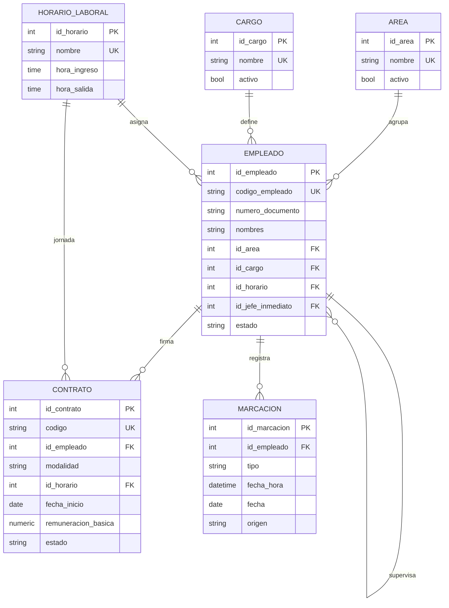
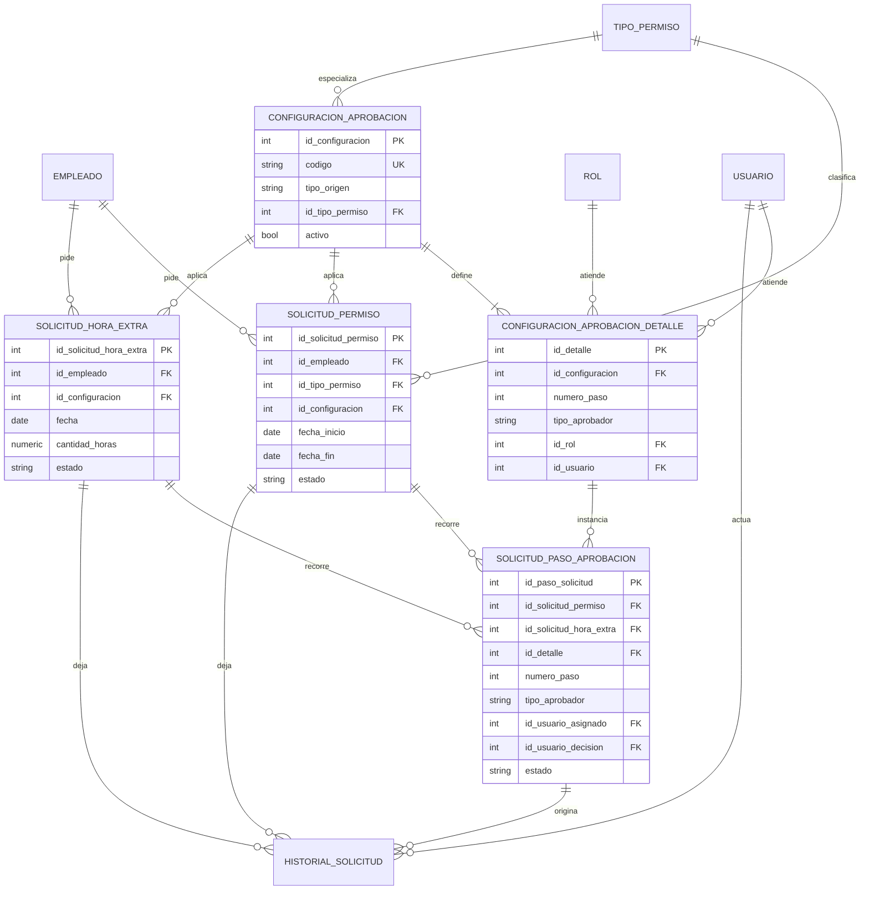
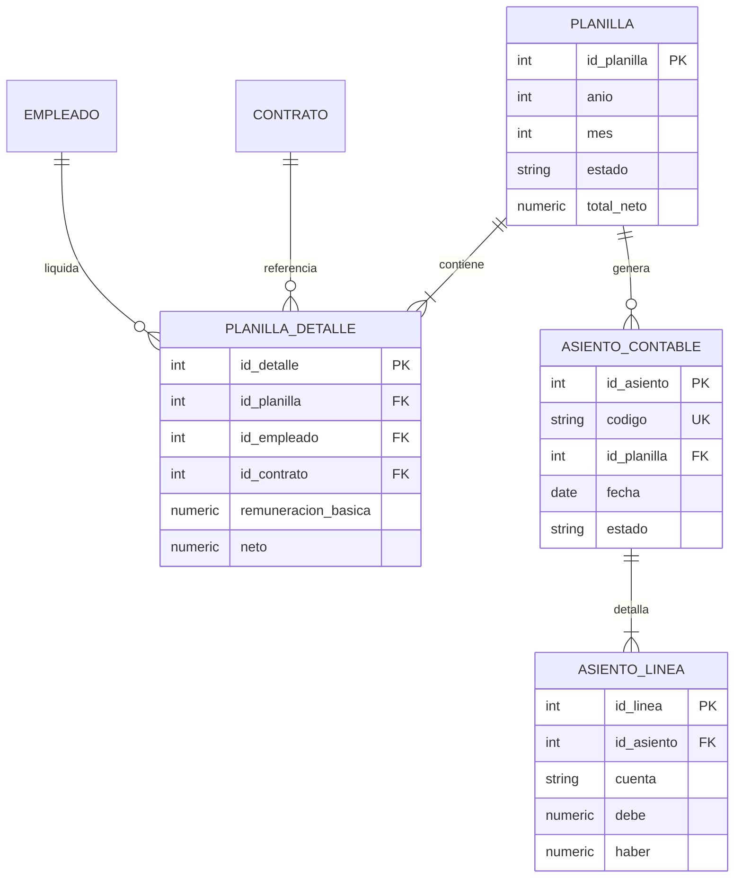
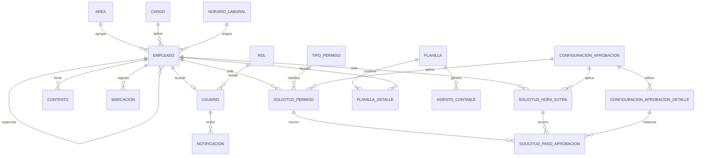

# MER — Sistema de Gestión de RR. HH. Andina

Modelo entidad-relación lógico de `rrhh_andina`, alineado con `database/01_install.sql`.

**Vista interactiva (recomendada para exposición):** [diagrams/rrhh-mer.html](diagrams/rrhh-mer.html) — pestañas por módulo e **Imprimir / PDF**.

Cardinalidades Mermaid: `||--o{` = 1:N, `||--|{` = 1:N obligatorio, `||--o|` = 1:0..1.  
La solicitud **no** guarda al aprobador: el circuito vive en `configuracion_aprobacion` y se instancia en `solicitud_paso_aprobacion`.

---

## 1. Organización y asistencia



`empleado.id_jefe_inmediato` es organigrama (no puede ser él mismo). Se usa cuando el paso del flujo es `JEFE_INMEDIATO`.

---

## 2. Seguridad, menú y sesión

```mermaid
erDiagram
    EMPLEADO ||--o| USUARIO : accede
    ROL ||--o{ USUARIO : otorga
    ROL ||--o{ ROL_PERMISO : tiene
    PERMISO_FUNCIONAL ||--o{ ROL_PERMISO : cubre
    MENU_ITEM ||--o{ MENU_ROL : aparece
    ROL ||--o{ MENU_ROL : ve
    USUARIO ||--o{ REFRESH_TOKEN : posee
    USUARIO ||--o{ NOTIFICACION : recibe
    USUARIO ||--o{ AUDITORIA : genera

    USUARIO {
        int id_usuario PK
        int id_empleado FK_UK
        int id_rol FK
        string nombre_usuario UK
        string correo UK
        bool activo
    }
    ROL {
        int id_rol PK
        string codigo UK
        string nombre
        bool activo
    }
    NOTIFICACION {
        int id_notificacion PK
        int id_usuario FK
        string tipo
        string titulo
        bool leida
        string ruta
    }
    REFRESH_TOKEN {
        int id_refresh_token PK
        int id_usuario FK
        string token UK
        bool revocado
    }
```

Roles semilla: `ADMIN`, `GERENCIA`, `RRHH`, `JEFE`, `EMPLEADO`.  
`notificacion.tipo`: `BANDEJA` · `APROBADA` · `RECHAZADA`.

---

## 3. Flujos de aprobación y trámites (núcleo del curso)



### Cómo se arma el circuito

```
EMPLEADO ──solicita──► SOLICITUD_PERMISO / SOLICITUD_HORA_EXTRA
                              │
                              │ usa
                              ▼
                    CONFIGURACION_APROBACION
                              │
                              │ 1:N pasos configurados
                              ▼
                 CONFIGURACION_APROBACION_DETALLE
                              │
                              │ se instancia (trigger)
                              ▼
                   SOLICITUD_PASO_APROBACION
                              │
                    ┌─────────┴─────────┐
                    │ Aprobar           │ Rechazar
                    ▼                   ▼
              siguiente paso      solicitud RECHAZADO
              o APROBADO          pasos restantes OMITIDO
```

Ejemplos de semilla: salud = Jefe → RRHH; vacaciones = Jefe → RRHH → GERENCIA; comisión = Jefe → GERENCIA.

---

## 4. Planilla y contabilidad



---

## 5. Mapa completo (solo relaciones)

Útil en diapositivas; sin atributos para que quepa en una hoja.



---

## 6. Cardinalidades (resumen)

| Relación | Tipo | Notas |
|---|---|---|
| AREA / CARGO / HORARIO → EMPLEADO | 1 : N | Todo colaborador tiene área, cargo y horario |
| EMPLEADO → EMPLEADO | 1 : N | `id_jefe_inmediato` |
| EMPLEADO → USUARIO | 1 : 0..1 | Como máximo una cuenta |
| EMPLEADO → CONTRATO | 1 : N | A lo sumo un `VIGENTE` por empleado |
| ROL → USUARIO | 1 : N | Perfil del mantenedor `rol` |
| ROL ↔ PERMISO_FUNCIONAL | N : M | Puente `rol_permiso` |
| MENU_ITEM ↔ ROL | N : M | Puente `menu_rol` |
| CONFIGURACION → DETALLE | 1 : N | Pasos `JEFE_INMEDIATO` / `ROL` / `USUARIO` |
| SOLICITUD → PASO | 1 : N | XOR permiso **o** hora extra |
| PLANILLA → DETALLE | 1 : N | Una fila por empleado del periodo |
| USUARIO → NOTIFICACION | 1 : N | Campana / STOMP |

`PARAMETRO_SISTEMA` no tiene FK: diccionario de claves (`zona_horaria`, topes de horas extras, etc.).

---

## 7. Tipos enumerados

| Tipo | Valores |
|---|---|
| `tipo_documento` | DNI, CE, PASAPORTE |
| `sexo_empleado` | M, F |
| `tipo_contrato` / `modalidad_contrato` | PLANILLA, RECIBO_HONORARIOS, PRACTICAS / COLABORADOR, PRACTICANTE |
| `estado_empleado` | ACTIVO, INACTIVO, CESADO |
| `tipo_marcacion` | INGRESO, SALIDA |
| `estado_solicitud` | PENDIENTE, APROBADO, RECHAZADO, CANCELADO |
| `tipo_origen_flujo` | PERMISO, HORA_EXTRA |
| `tipo_aprobador` | JEFE_INMEDIATO, ROL, USUARIO |
| `estado_paso_aprobacion` | PENDIENTE, EN_CURSO, APROBADO, RECHAZADO, OMITIDO, CANCELADO |
| `estado_planilla` | BORRADOR, CALCULADA, CERRADA, ANULADA |
| `estado_asiento` | BORRADOR, CONTABILIZADO, ANULADO |
| `estado_evaluacion` | BORRADOR, CERRADA |
| `estado_convocatoria` | ABIERTA, CERRADA, CANCELADA |
| `estado_postulacion` | POSTULADO, ENTREVISTA, SELECCIONADO, CONTRATADO, DESCARTADO |
| `formato_reporte` | EXCEL, PDF |
| `estado_carga` | PROCESANDO, COMPLETADA, COMPLETADA_CON_ERRORES, FALLIDA |

---

## 8. Módulos (tablas)

| Módulo | Tablas |
|---|---|
| Organización | `area`, `cargo`, `horario_laboral`, `empleado`, `contrato` |
| Seguridad | `rol`, `permiso_funcional`, `rol_permiso`, `usuario`, `refresh_token`, `notificacion` |
| Menú | `menu_item`, `menu_rol` |
| Catálogos | `tipo_permiso`, `parametro_sistema`, `cuenta_contable` |
| Flujos | `configuracion_aprobacion`, `configuracion_aprobacion_detalle` |
| Trámites | `solicitud_permiso`, `solicitud_hora_extra`, `solicitud_paso_aprobacion`, `historial_solicitud` |
| Asistencia | `marcacion` |
| Operación | `carga_masiva`, `carga_masiva_detalle`, `reporte_generado`, `auditoria` |
| Planillas | `planilla`, `planilla_detalle` |
| Contabilidad | `asiento_contable`, `asiento_linea` |
| Desempeño | `evaluacion_desempeno` |
| Reclutamiento | `convocatoria`, `postulacion` |
